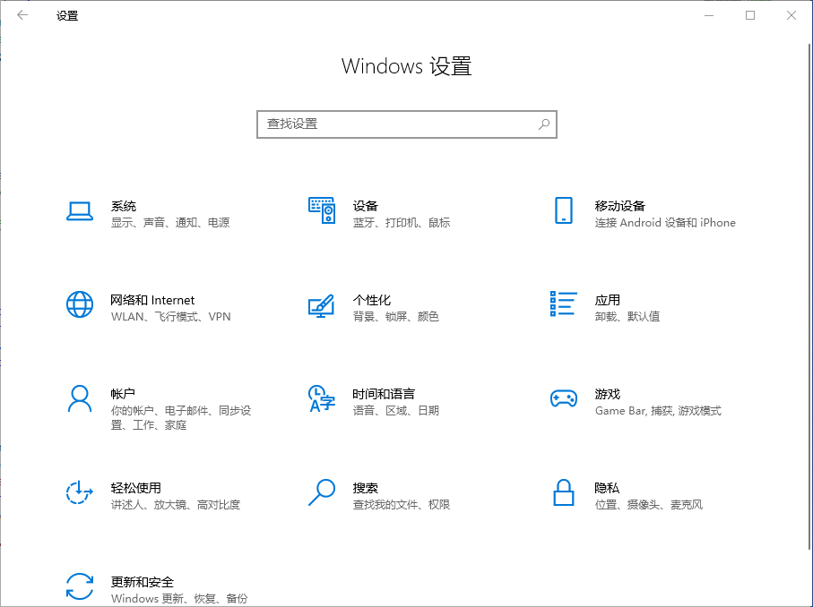
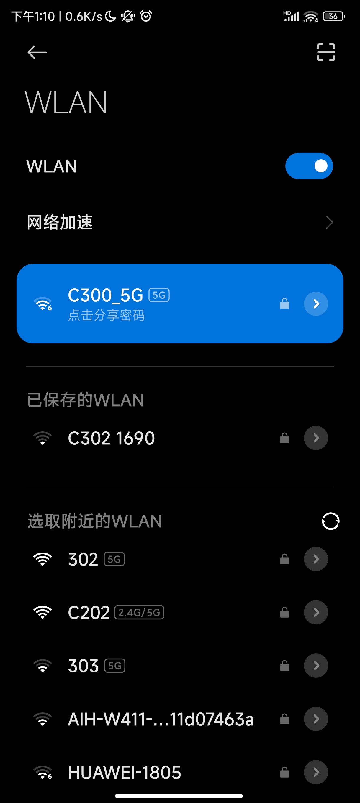
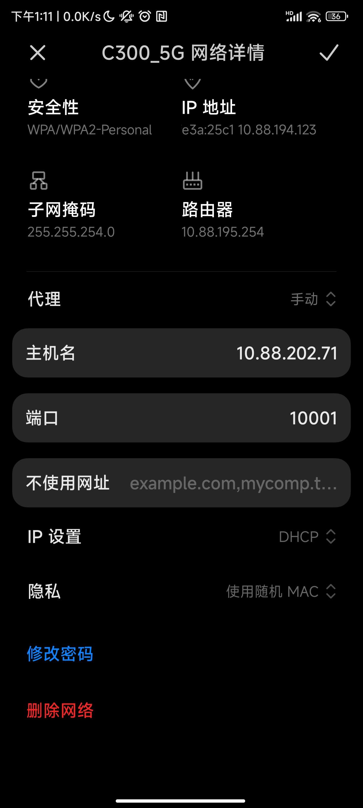

# 怎么在学校访问互联网

---

 

## 使用代理连接网络
*注意：此方法大部分情况下仅能使得浏览器访问互联网，更稳定的方式详见“使用VPN连接网络”*
### 使用Windows电脑

首先，打开设置

点击网络和internet，选择代理

开启“使用代理服务器”

在地址中填入“10.88.202.71”，端口填入10001后
即可正常连接互联网

在地址中填入“10.88.202.71”，端口填入10002后
即可连接外网

然后，**点击保存**

**注意：外网访问速度较慢**.

### 使用手机

首先，打开手机的设置

连接校园网中的WiFi，有关教学楼中的WiFi密码，请参阅教程中的《教学楼中的WiFi密码登记》一节。

然后，点击Wi-Fi，进入wifi设置页面

找到“代理”选项，将“代理”更改为“手动”模式

在地址中填入“10.88.202.71”，端口填入10001后
即可正常连接互联网

在地址中填入“10.88.202.71”，端口填入10002后
即可连接外网

 

## 使用VPN连接网络

 
### 使用手机
打开WiFi设置

连接校园网

返回设置界面，点击VPN

点击新建VPN

名称填写你想要的名称

地址填写 **10.88.202.71**

预共享密钥填写 **pysyzx**

用户名为 **ps**

密码为   **ps10.88.202.71**

**注意：没有提到的选项不要填写**

然后，**点击保存**
 
 
### 使用电脑

打开设置

点击网络和Internet

点击VPN

点击添加VPN连接

名称填写你想要的名称

地址填写 **10.88.202.71**

预共享密钥填写 **pysyzx**

用户名为 **ps**

密码为   **ps10.88.202.71**

然后，**点击保存**

<i>作者：Yuebi</i> 
<i>日期：2024年11月30日</i>

